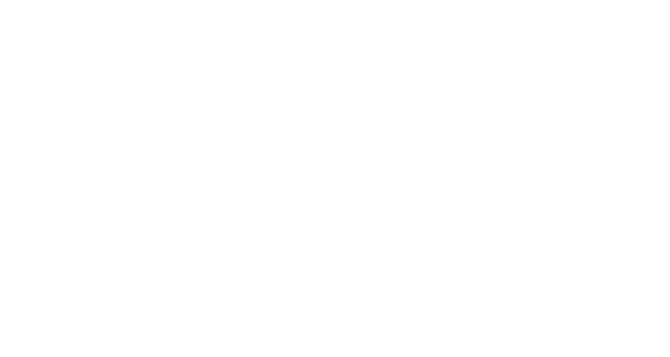

<div align="center">



# Amazon Aquabio

**Plataforma web para exploração da diversidade mitogenômica de peixes amazônicos.**

🌐 **[Acessar a aplicação](https://julio-csilva.github.io/Amazon_Aquabio/)**

🇧🇷 Português &nbsp;|&nbsp; 🇬🇧 [English](README.en.md)


[](https://doi.org/10.5281/zenodo.20634179)


</div>

---

## 📖 Sobre

**Amazon Aquabio** é uma *single-page application* (SPA) bilíngue (Português / Inglês) que apresenta os
resultados de um estudo de **mitogenômica de peixes da Amazônia**. A partir de *data mining* em repositórios
públicos do **NCBI**, o projeto reconstruiu **100 mitogenomas de 34 espécies** de peixes amazônicos e
disponibiliza, de forma interativa:

- a galeria de espécies com seus dados de conservação (IUCN Red List);
- as análises de cada amostra — **sintenia, RSCU e repetições em tandem da D-loop são interativas**, calculadas a partir dos dados publicados no próprio site; mitogenoma circularizado e tRNA seguem como imagem;
- uma **ferramenta de comparação** lado a lado entre amostras selecionadas;
- a metodologia completa do pipeline bioinformático;
- o mapa de distribuição das espécies na bacia amazônica;
- a equipe de pesquisadores e um canal de contato.

O projeto é mantido pelo grupo **BioME (Bioinformatics Multidisciplinary Environment)** do
**Instituto Metrópole Digital (IMD/UFRN)**.

---

## ✨ Funcionalidades

- 🌍 **Bilíngue (PT-BR / EN)** — alternância de idioma em tempo real via React Context.
- 🐟 **Galeria de espécies** — busca por nome comum, nome científico ou código SRA, com filtro por status da IUCN Red List.
- 🔬 **Modal de detalhes** — ficha de cada espécie com descrição, licença de imagem, abas por amostra e carrossel das análises, com *zoom* e download de FASTA / NCBI / Genes FASTA.
- 🧪 **Ferramenta de comparação** — seleção de múltiplas amostras (SRAs) e visualização comparativa em nova aba.
- 🗺️ **Mapa interativo** — distribuição das 34 espécies na bacia amazônica (mapa embutido).
- 📚 **Metodologia interativa** — cards por etapa do pipeline, com diagrama e regiões destacadas em modal.
- 👥 **Carrossel de pesquisadores** — com links para Lattes, LinkedIn e ORCID.
- 📨 **Formulário de contato** — envio de mensagens via [EmailJS](https://www.emailjs.com/) + mapa de localização institucional.
- 📱 **Responsivo** — layout adaptado para *desktop* e *mobile* (menu *drawer*, grids fluidos).

---

## 🧬 O estudo (resumo)

| Item | Valor |
|------|-------|
| Espécies analisadas | **34** |
| Mitogenomas reconstruídos | **100** |
| Família predominante | *Cichlidae* |
| Fonte dos dados | Repositórios públicos do **NCBI / SRA** (destaque para o projeto `PRJEB48774` — Sanger Institute) |
| Mitogenoma semente | *Pygocentrus nattereri* (`NC_015840.1`) |
| Tecnologia de sequenciamento | Illumina *paired-end* (WGS) |

---

## 🛠️ Tecnologias

| Categoria | Ferramentas |
|-----------|-------------|
| **Core** | [React 18](https://react.dev/), [Vite 6](https://vitejs.dev/) |
| **Roteamento** | [React Router 6](https://reactrouter.com/) (`createHashRouter`) |
| **UI / Estilo** | [Chakra UI](https://chakra-ui.com/), [styled-components](https://styled-components.com/), [Framer Motion](https://www.framer.com/motion/) |
| **Gráficos** | [Plotly.js](https://plotly.com/javascript/) (bundle `cartesian`, carregado sob demanda) |
| **Zoom de imagem** | [react-medium-image-zoom](https://github.com/rpearce/react-medium-image-zoom) |
| **Ícones / UX** | [react-icons](https://react-icons.github.io/react-icons/), [react-countup](https://github.com/glennreyes/react-countup), [react-intersection-observer](https://github.com/thebuilder/react-intersection-observer) |
| **Formulário** | [@emailjs/browser](https://www.emailjs.com/) |
| **Qualidade / Deploy** | [ESLint](https://eslint.org/), [gh-pages](https://github.com/tschaub/gh-pages) |

---

## 📂 Estrutura do projeto

```
Amazon_Aquabio/
├── index.html                  # HTML raiz (favicons, manifest, #root)
├── vite.config.js              # Config do Vite (base: "/Amazon_Aquabio/")
├── package.json                # Dependências e scripts
├── public/                     # Assets estáticos servidos diretamente
│   ├── mapa_peixes.html        # Mapa interativo da bacia amazônica (iframe)
│   ├── images/                 # Imagens (b2..b8, logos, peixes, padrões)
│   │   └── b8/                 # Análises geradas por amostra:
│   │       ├── circularized/   #   mitogenoma circularizado
│   │       ├── trna/           #   estrutura de tRNA
│   │       ├── circos/         #   gráfico Circos
│   │       └── coverage/       #   análise de cobertura
│   ├── data/                   # 📊 Dados das análises interativas (gerados)
│   │   ├── sintenia.json       #   ordem e coordenadas gênicas, 100 amostras
│   │   ├── rscu.json           #   RSCU por amostra + consensos por grupo
│   │   └── tandem_repeats.json #   repetições da região controle, 32 espécies
│   ├── docs/b8/                # Arquivos para download
│   │   ├── fasta/              #   mitogenomas (.fa)
│   │   ├── gens_fasta/         #   genes (.fa)
│   │   └── NCBI/               #   metadados NCBI (.txt)
│   ├── icons/                  # Ícones e favicons
│   └── Fonts/                  # Fontes customizadas
├── pipeline/                   # ⚙️ Geração dos JSON de análise (Python, stdlib)
│   ├── build_all.py            #   roda os três builds
│   ├── build_sintenia.py       #   *_genes.fa  -> sintenia.json
│   ├── build_rscu.py           #   *_genes.fa  -> rscu.json
│   ├── build_tandem_repeats.py #   tsv_tr/     -> tandem_repeats.json
│   ├── vendor/                 #   sintenia_io / sintenia_theme (cópia marcada)
│   └── dados_entrada/          #   TSVs de TRF e consensos de RSCU
└── src/
    ├── main.jsx                # Entry point: HashRouter + ChakraProvider + tema
    ├── App.jsx                 # Layout: cabeçalho fixo, fundo, footer, LanguageProvider
    ├── theme.js                # Tema do Chakra UI (fontes)
    ├── fotos.json              # 🗄️ Dataset principal (34 espécies / 100 amostras)
    ├── by_links.json           # Imagens de atribuição (base64) por espécie
    ├── routes/
    │   ├── home.jsx            # Página inicial (monta as seções B1..B8)
    │   ├── contato.jsx         # Página de contato (EmailJS + mapa)
    │   └── error-page.jsx      # Página de erro de rota
    ├── analises/               # 📈 Análises interativas (Plotly, sob demanda)
    │   ├── SinteniaPlot.jsx    #   posição · ordem gênica · comprimento por gene
    │   ├── RscuPlot.jsx        #   empilhado · mapa de calor · barras por códon
    │   ├── TandemRepeatsPlot.jsx#  mapa da região controle · cópias × extensão
    │   ├── AbasDaAmostra.jsx   #   as 5 análises de uma amostra, em abas
    │   ├── dados.js            #   busca e cache dos JSON de public/data/
    │   └── tema.js             #   tinta e layout comuns às figuras
    ├── componentes/            # Componentes compartilhados
    │   ├── Cabecalho/          #   Header fixo + navegação + toggle de idioma
    │   ├── Footer/             #   Rodapé
    │   ├── LanguageContext/    #   Context de internacionalização (PT/EN)
    │   ├── ModalZoom/          #   Modal de detalhes da espécie
    │   ├── ButtonPersonalizado/#   Botão de navegação customizado
    │   └── EstilosGlobais/     #   Estilos globais
    ├── Home/                   # Seções da página inicial (blocos B1..B8)
    │   ├── B1_Apresentacao/    #   Hero / apresentação
    │   ├── B2_Definicao/       #   "O que é o genoma mitocondrial?"
    │   ├── B3_Peixes/          #   Destaque de espécies
    │   ├── B4_Mapa/            #   Mapa de distribuição
    │   ├── B5_Metodologia/     #   Pipeline (cards + modal)
    │   ├── B6_Comparador/      #   Ferramenta de comparação + visualizador
    │   ├── B7_Pesquisadores/   #   Carrossel da equipe
    │   ├── B8_Galeria/         #   Galeria + filtros
    │   └── BX_Publicações/     #   Publicações (reservado, não ativo)
    └── utils/
        └── iucnUtils.js        # Mapeia status da IUCN → gradiente CSS
```

---

## 📈 Análises interativas

Sintenia, RSCU e repetições em tandem da região controle deixaram de ser PNG e
passaram a ser desenhadas no navegador a partir de dados versionados em
`public/data/`. O que isso muda:

- **Comparar virou uma figura só.** No comparador, as amostras selecionadas
  entram no mesmo eixo em vez de virarem N imagens empilhadas.
- **Cada valor é auditável.** Sintenia e RSCU são calculados dos `_genes.fa`
  que o site distribui: baixe o arquivo, rode `pipeline/build_rscu.py` e você
  chega ao mesmo número da tela.
- **O site ficou mais leve.** Os três JSON somam ~170 KB, contra os 14 MB de
  PNG que substituíram, e o Plotly (~477 KB gzip) só é baixado por quem abre
  uma análise.

Para regerar os dados:

```bash
python3 pipeline/build_all.py --validar
```

Detalhes de convenção, ressalvas de qualidade e uma divergência encontrada no
RSCU publicado estão em [`pipeline/README.md`](pipeline/README.md).

---

## 🗂️ Modelo de dados

O conteúdo é orientado por dados, definido em [`src/fotos.json`](src/fotos.json). Cada **espécie** contém uma
lista de **amostras** (`amostras`), e cada amostra referencia as imagens e arquivos gerados pelo pipeline.

```jsonc
{
  "especie": "Acarichthys heckelii",   // nome científico
  "nome": "Ciclídeo cabeça de ouro",   // nome comum (PT)
  "nome_en": "Threadfin acara",        // nome comum (EN)
  "path": "images/b3/Acarichthys_heckelii_by(Nilsson_Kjell).jpg",
  "by": "by(Nilsson_Kjell)",           // atribuição da imagem
  "descricao": "...",                  // descrição (PT)
  "descricao_en": "...",               // descrição (EN)
  "redlist_status": "LC",              // status IUCN: NE, DD, LC, NT, VU, EN, CR, EW, EX
  "id": 0,
  "tagId": 2,
  "amostras": [
    {
      "id": 1,
      "sra": "ERR10768189",            // código de acesso NCBI SRA
      "path_mito_circularized": "images/b8/circularized/...png",
      "path_trna":              "images/b8/trna/...png",
      "path_circos":            "images/b8/circos/...png",
      "path_coverage":          "images/b8/coverage/...png",
      "path_fasta":             "docs/b8/fasta/...fa",       // download: mitogenoma
      "path_gensFasta":         "docs/b8/gens_fasta/...fa",  // download: genes
      "path_NCBI":              "docs/b8/NCBI/...txt"         // download: metadados
    }
  ]
}
```

> 📌 **Para adicionar uma espécie/amostra:** insira o objeto em `src/fotos.json` e coloque as imagens/arquivos
> correspondentes nas pastas de `public/images/b8/...` e `public/docs/b8/...`, mantendo o padrão de nomes dos `path_*`.

O arquivo [`src/by_links.json`](src/by_links.json) guarda as imagens de atribuição (em *base64*), associadas a
cada espécie pelo `id`.

---

## 🚀 Como executar

### Pré-requisitos

- [Node.js](https://nodejs.org/) **18+** (recomendado LTS)
- npm (acompanha o Node) ou outro gerenciador de pacotes

### Passo a passo

```bash
# 1. Clone o repositório
git clone https://github.com/Julio-CSilva/Amazon_Aquabio.git
cd Amazon_Aquabio

# 2. Instale as dependências
npm install

# 3. Inicie o servidor de desenvolvimento
npm run dev
```

A aplicação ficará disponível em **http://localhost:5173/Amazon_Aquabio/** (o caminho `/Amazon_Aquabio/` vem do
`base` configurado em `vite.config.js`).

---

## 📜 Scripts

| Script | Descrição |
|--------|-----------|
| `npm run dev` | Inicia o servidor de desenvolvimento (Vite + HMR). |
| `npm run build` | Gera a *build* de produção em `dist/`. |
| `npm run preview` | Pré-visualiza localmente a *build* de produção. |
| `npm run lint` | Executa o ESLint em todo o projeto. |
| `npm run deploy` | Publica a pasta `dist/` no GitHub Pages (via `gh-pages`). |

---

## 🌐 Deploy (GitHub Pages)

O projeto é publicado no **GitHub Pages**. O `base` em `vite.config.js` está definido como `"/Amazon_Aquabio/"` e
o roteamento usa `HashRouter`, garantindo o funcionamento das rotas em hospedagem estática.

```bash
npm run build    # gera a pasta dist/
npm run deploy   # publica dist/ na branch gh-pages
```

🔗 Aplicação publicada: **https://julio-csilva.github.io/Amazon_Aquabio/**

> ℹ️ Caso faça *fork* para outra conta/repositório, ajuste o `base` em `vite.config.js` e a URL acima.

---

## 🧪 Metodologia (pipeline)

O pipeline bioinformático apresentado na seção **Metodologia** do site segue cinco etapas:

1. **Seleção da amostra** — espécies escolhidas por endemicidade, relevância econômica/evolutiva e baixa
   representatividade mitogenômica no NCBI (mínimo de 3 conjuntos de dados por espécie, WGS Illumina *paired-end*).
2. **Montagem dos mitogenomas** — pipeline [Mitomine](https://github.com/gleisonm/mitomine) com **NOVOPlasty v4.3**
   (semente *Pygocentrus nattereri*, `NC_015840.1`), **Unicycler v0.5.0**, **BWA v0.7.12** e validação cruzada com **BLAST v2.16**.
3. **Anotação genômica** — anotação dupla com **MitoAnnotator / MitoFish v4.03** e **MITOS2 v2.1.9** (código genético de vertebrados, RefSeq63 Metazoa).
4. **Análises e região reguladora** — PCGs, tRNAs, rRNAs e D-loop; alinhamentos com **MAFFT v7**, estruturas de tRNA com **tRNAscan-SE v2.0** + **R2DT v24**, repetições com **Tandem Repeats Finder v4.10.0**.
5. **Validação e controle de qualidade** — detecção de heteroplasmia/NUMTs com **NOVOPlasty v4.3.1**, RSCU com **CaiCal v1.4** + Python, verificação dos 37 genes (13 PCGs, 22 tRNAs, 2 rRNAs) e correlação de Spearman em **R v4.4.1**.

---

## 🧭 Seções do site

| Bloco | Seção | Descrição |
|-------|-------|-----------|
| **B1** | Apresentação | Hero com a proposta do projeto. |
| **B2** | Definição | O que é o genoma mitocondrial. |
| **B3** | Peixes | Destaque visual das espécies. |
| **B4** | Mapa | Distribuição das espécies na bacia amazônica. |
| **B5** | Metodologia | Pipeline em cards interativos + modal com diagrama. |
| **B6** | Comparador | Seleção de SRAs e visualização comparativa. |
| **B7** | Pesquisadores | Carrossel da equipe (Lattes / LinkedIn / ORCID). |
| **B8** | Galeria | Grade de espécies com busca e filtro por IUCN. |

---

## 🌍 Internacionalização (PT / EN)

A troca de idioma é feita por um **React Context** ([`src/componentes/LanguageContext`](src/componentes/LanguageContext/index.jsx)).
O idioma padrão é **inglês (`en`)** e cada componente mantém seus próprios textos em um objeto `texts = { pt, en }`.
Os campos de conteúdo do dataset também são bilíngues (`nome`/`nome_en`, `descricao`/`descricao_en`).

---

## 👥 Equipe

Projeto desenvolvido pelo grupo **BioME — Bioinformatics Multidisciplinary Environment**, do
**Instituto Metrópole Digital (IMD)**, **Universidade Federal do Rio Grande do Norte (UFRN)**.

A lista completa de pesquisadores, com links para Lattes, LinkedIn e ORCID, está disponível na seção
**Pesquisadores** da aplicação.

---

## 📨 Contato

**Jorge Estefano Santana de Souza** *(autor correspondente)*
Bioinformatics Multidisciplinary Environment (BioME) — Instituto Metrópole Digital, UFRN — Natal/RN, Brasil
✉️ jorge@imd.ufrn.br

Ou utilize o formulário de contato disponível na própria aplicação.

---

## 📄 Licença

- **Código-fonte:** licenciado sob a **[Licença MIT](LICENSE)** — uso, cópia, modificação e redistribuição livres, mantendo o aviso de copyright.
- **Imagens das espécies:** disponibilizadas sob **[CC BY-NC-SA](https://creativecommons.org/licenses/by-nc-sa/4.0/)**, com a devida atribuição aos respectivos autores (campo `by` no dataset).

---

<div align="center">

Feito com 💙 pelo grupo **BioME / IMD-UFRN**

</div>
